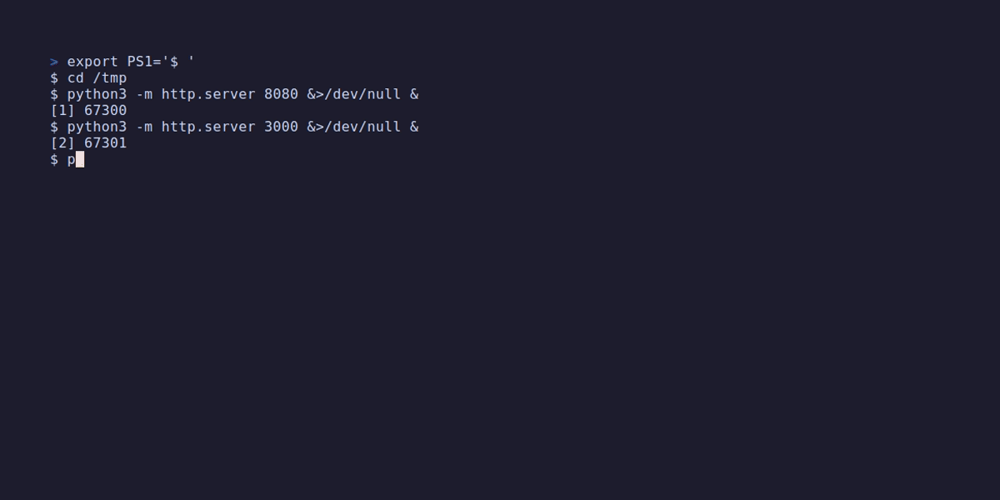

<div align="center">


A fast, friendly CLI/TUI tool for viewing port usage and killing processes.

Quickly resolve "port already in use" errors — check ports, identify processes, and kill them in a single command.

[日本語版 README](README.ja.md)

<!-- Replace with your own demo GIF -->


</div>

## Installation

```bash
cargo install --path .
```

## Usage

### List all listening ports

```bash
pwatch list
```

Output as JSON:

```bash
pwatch list --json
```

### Check a specific port

```bash
pwatch check 8080
```

### Kill a process using a port

```bash
pwatch kill 8080          # SIGTERM
pwatch kill 8080 --force  # SIGKILL
```

If you get a permission error:

```bash
sudo pwatch kill 8080
```

### TUI mode

```bash
pwatch ui
```

| Key | Action |
|-----|--------|
| `j` / `↓` | Move selection down |
| `k` / `↑` | Move selection up |
| `d` | Kill with SIGTERM (with confirmation) |
| `D` | Kill with SIGKILL (with confirmation) |
| `/` | Search mode |
| `r` | Refresh |
| `q` / `Esc` | Quit |

## Supported Platforms

| OS | Scan Method |
|----|-------------|
| Linux | Direct `/proc/net/tcp` parsing |
| macOS | Via `lsof` command |

## Build

```bash
cargo build --release
```

## License

MIT
